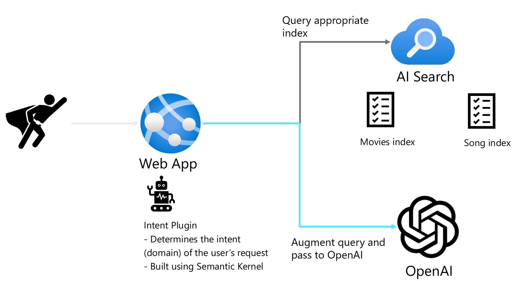

# semantic-kernel-intent



The Retrieval, Augment, Generatation (RAG) pattern is a very effective pattern for grounding the Azure OpenAI service with relevant data in order to respond to user questions.

The RAG pattern is needed because we have to limit the data that is passed to the OpenAI service to only relevant information. We cannot pass all the data we have with each query, both due to token limitations and due to the tendency for the AI to hallucinate if we give it too much irrelevant information.

The RAG pattern lets us query an external data source (such as Azure AI Search) to get relevant information that we can append to the prompt when we call OpenAI.

This pattern is easy to implement if there is only one external data source.

However, we might want to separate the Azure AI Search indexes into multiple indexes. Common reasons to do this might be due to not wanting to have 1 index with documents that might have similar keywords, but are used in different contexts. It might also be due to different authorization requirements.

We can use Semantic Kernel to help orchestrate this workflow.

Our Intent plugin is a "prompt" plugin, meaning it is based upon a prompt (as opposed to a "native" plugin, which would be implemented in code (C#, Python, etc.).

We will craft our Intent plugin prompt to allow the OpenAI service to determine the user's intent by providing example questions, keywords, etc. to help it decide which domain the question is specifically targeting.

We are going to provide a list of pre-defined intents (choices) to restrict what can be chosen. We will then switch off this value when the result comes back.

Here is my [blog post](https://jordanbeandev.com/how-to-build-an-azure-openai-intent-plugin-in-semantic-kernel-to-help-orchestrate-which-azure-ai-search-index-to-use/) that goes into more detail.

## Disclaimer

**THE SOFTWARE IS PROVIDED "AS IS", WITHOUT WARRANTY OF ANY KIND, EXPRESS OR IMPLIED, INCLUDING BUT NOT LIMITED TO THE WARRANTIES OF MERCHANTABILITY, FITNESS FOR A PARTICULAR PURPOSE AND NONINFRINGEMENT. IN NO EVENT SHALL THE AUTHORS OR COPYRIGHT HOLDERS BE LIABLE FOR ANY CLAIM, DAMAGES OR OTHER LIABILITY, WHETHER IN AN ACTION OF CONTRACT, TORT OR OTHERWISE, ARISING FROM, OUT OF OR IN CONNECTION WITH THE SOFTWARE OR THE USE OR OTHER DEALINGS IN THE SOFTWARE.**

## Prerequisites

- [Azure CLI](https://docs.microsoft.com/en-us/cli/azure/install-azure-cli)
- Azure subscription & resource group
- [Azure OpenAI](https://learn.microsoft.com/en-us/azure/ai-services/openai/overview)
- [Azure AI Search](https://learn.microsoft.com/en-us/azure/search/search-what-is-azure-search)

## Run

1. Deploy the Azure OpenAI service & the Azure AI Search
    - Note that this demo assumes there is a 'movies' and 'songs' index in the AI Search service. You would modify these as needed for your index names.

1. Create a `.env` file in the `./src` directory to indicate to the app where to find your Azure services and how to authenticate.

```python
AZURE_OPENAI_DEPLOYMENT_NAME=""
AZURE_OPENAI_ENDPOINT=""
AZURE_OPENAI_API_KEY=""
AZURE_AISEARCH_URL=""
AZURE_AISEARCH_API_KEY=""
```
  
1. Run the following code to execute the sample app.

```shell
cd src

python -m venv ./api_env

./api_env/Scripts/activate

python -m pip install -r requirements.txt

python ./main.py
```

## Links

- [Semantic Kernel](https://learn.microsoft.com/en-us/semantic-kernel/overview/)
- [Intent plugin sample in Semantic Kernel demo code](https://github.com/microsoft/semantic-kernel/tree/main/samples/plugins/IntentDetectionPlugin/AssistantIntent)
